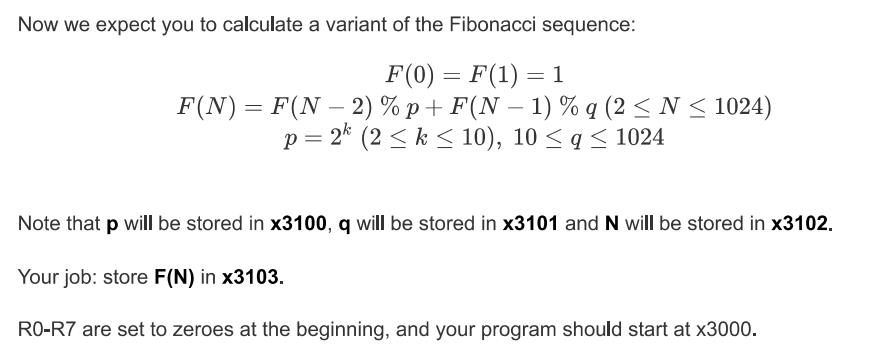
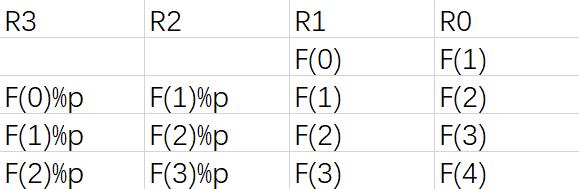

#Lab2 实验报告
### PB21151807 刘海琳
###（一）实验目的
- 本实验将通过使用LC-3 Tools编写汇编码，利用LC-3中的基本指令和寄存器解决以下问题。

  
###（二）实验原理 
 - 求余数：
   1、对于任意的正整数q，求x%q：用x不断减去q，直到剩下的数为负数，求得的第一个负数再加回q就是x%q的值(模为0也成立)。
   2、计算减法x-q时，应该令q取反加一后与x相加。
 - 数列的保存：
   由递推公式F(N)=F(N-1)%q+F(N-2)%p可知，计算F(N)时至少要有两个寄存器保存F(N-1)和F(N-2)，并且还有两个寄存器需要存放F(N-1)%q和F(N-2)%p，具体规划如下：
   以此类推，但是记得在计算F(N)存入R0之前先把F(N-1)迁移到R1，否则数据丢失。
 - 数列的循环：
   由于F(0)和F(1)已知，所以循环一共执行N-1次，在进入循环之前N应该先计算减一。
 
###（三）实验过程
 - 错将LDI写成LD，导致一开始的数字导不进去。


###（四）测试结果


###（五）一些改进
 - 由于题目中p=2*k的特殊性，计算x%p时可以将操作简化成计算x AND (p-1)的结果，在二进制下x%p=x AND (p-1)。
 - 如果同一寄存器保存的数据不是同一类型的，循环代码需要多写几轮。

###（六）完整代码
```
.ORIG x3000
;数字准备
ADD R1, R1, #1   ;F(0)放入R1
ADD R0, R0, #1   ;F(1)放入R0
LDI R5, QNUMBER  ;加载数字q
NOT R6, R5
ADD R6, R6, #1   ;-q
LDI R4, PNUMBER  ;加载数字p
ADD R4, R4, #-1  ;p-1
LDI R7, NNUMBER  ;加载数字N
ADD R7, R7, #-1  ;N-1
;计算过程
AGAIN AND R3, R1, R4    ;F(0)%p
ADD R2, R0, #0
ADD R2, R2, R6
BRzp #-2
ADD R2, R2, R5    ;F(1)%q
ADD R1, R0, #0    ;F(1)迁移到R1
ADD R0, R2, R3    ;F(2)
STI R0, RESULT    ;保存结果至x3103
ADD R7, R7, #-1
BRnp AGAIN
TRAP x25

PNUMBER .FILL x3100
QNUMBER .FILL x3101
NNUMBER .FILL x3102
RESULT  .FILL x3103
.END
```