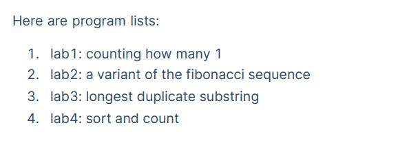
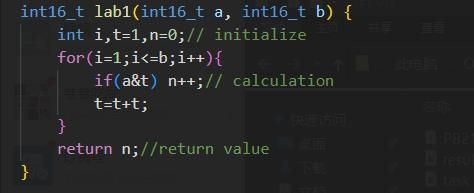
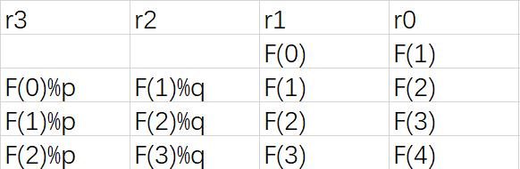
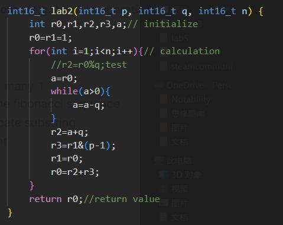
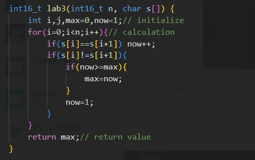
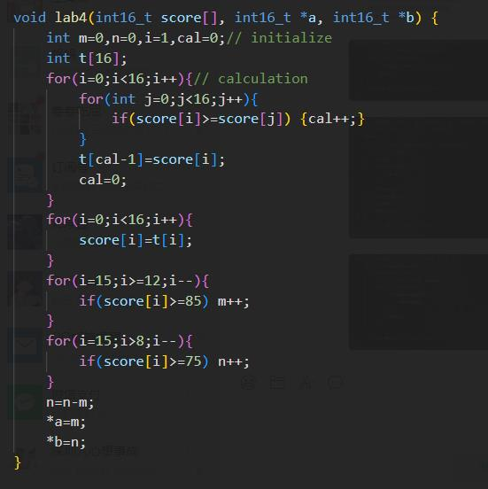
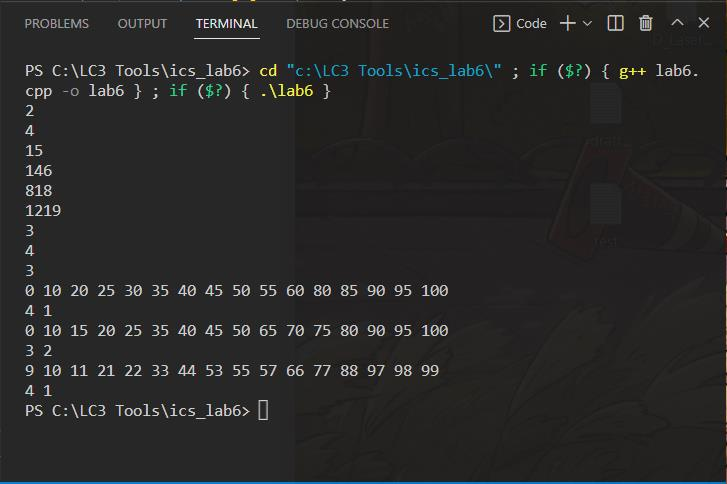

#Lab6 实验报告
### PB21151807 刘海琳
###（一）实验目的
- 本实验将通过使用C++编写程序，用更高级的语言实现前四个lab的功能，清单如下：


###（二）实验原理 
 - lab1:计算a的二进制数字中前b位有多少个1
思路：i用于b位的计数，n用于1个数的计数，t初始值为1。在for循环中，让a与t相与，如果结果不为0，则说明这一位上a的数字为1，此时n++。每次t=t+t来更新t值，二进制下，t=0001，t=0010，t=0100，t=1000，就可以将比较的位左移。函数最后返回n值即可。
   
 - lab2：计算特殊斐波那契数列的F(N)
思路：r0至r3的数值分配如下图所示，在for循环中依次更新r2、r3、r1、r0的值。在计算x%q时，令x不断减去q直至为负值，取得的第一个负数加q得到的数字即是x%q的值。特别地，当p为2的k次幂时，x%p=x&(p-1)。函数最后返回r0的值，也就是F(N)。
   
   
 - lab3:计算最长相同子串长度
思路：令max为最长相同子串长度，now为当前相同子串长度，now初始值为1。接下来开始遍历字符串，如果当前字符与下一个字符相同，那么now++；如果不同，说明当前子串结束，更新max的值，并且将now重新置为1，函数最后返回max的值即可。
   
 - lab4：将16个学生成绩按照单调递增规则排序，并且计算得到等级A和B的学生人数
思路：利用辅助数组t和一个双循环完成排序。对于score[i]，遍历score中所有元素，计算score中小于等于当前score[i]的数字个数cal，t[cal-1]就是当前score[i]应该存入的位置，如此遍历16次后，在数组t中完成排序。将数组t的元素复制到score中即可。计算等级A的学生个数时只要在前四个学生中看他们的成绩是否大于85，是的话m++，m存放等级A的学生个数。计算等级B学生个数只要在前八个学生里面看成绩大于75的学生数n，再用n=n-m计算出等级B的学生个数。
   
 
###（三）实验过程
 - 基本上只要按照前四次实验的思路写就可以了，在写循环的时候要注意是否更新数值，比如说lab3中，如果当前字符和后一个字符不相同更新max值之后也要将now值重置为1，否则now值会一直增大。

###（四）测试结果
 - 测试结果如下：


###（五）LC-3与C语言的比较
 - LC-3汇编语言作为更底层的语言工具，使用起来更加的繁琐，比如说连减法都需要先取反再加一，而C语言可以直接实现减法。但是LC-3对数据的处理更为直接，可扩展性高，可以直接从寄存器和内存层面对数据进行操作，理论上可以实现比C语言更多的功能。
 - LC-3可以增加一些函数，来涵盖如同*,/,%之类的功能，使得数据运算上更加简洁，但是又不影响这种语言的灵活性。
 - 学习LC-3之后，笔者对于C语言中的指针、全局变量、局部变量、函数调用、形参实参之类的概念更加清晰了。笔者原本对于指针等与内存地址相关的概念很模糊，说是地址，其实也只是一个很抽象的概念。在学习了LC-3相关的内容之后，抽象的概念就和实际的应用关联起来了。

###（六）完整代码
 - 使用的代码框架与实验文档中的相同
```
#include <cstdint>
#include <iostream>
#include <fstream>
#define MAXLEN 100
#ifndef LENGTH
#define LENGTH 3
#endif

int16_t lab1(int16_t a, int16_t b) {
    int i,t=1,n=0;// initialize
    for(i=1;i<=b;i++){
        if(a&t) n++;// calculation
        t=t+t;
    }
    return n;//return value
}

int16_t lab2(int16_t p, int16_t q, int16_t n) {
    int r0,r1,r2,r3,a;// initialize
    r0=r1=1;
    for(int i=1;i<n;i++){// calculation
        //r2=r0%q;test
        a=r0;
        while(a>0){
            a=a-q;
        }
        r2=a+q;
        r3=r1&(p-1);
        r1=r0;
        r0=r2+r3;
    }
    return r0;//return value
}

int16_t lab3(int16_t n, char s[]) {
    int i,j,max=0,now=1;// initialize
    for(i=0;i<n;i++){// calculation
        if(s[i]==s[i+1]) now++;
        if(s[i]!=s[i+1]){
            if(now>=max){
                max=now;
            }
            now=1;
        }
    }
    return max;// return value
}

void lab4(int16_t score[], int16_t *a, int16_t *b) {
    int m=0,n=0,i=1,cal=0;// initialize
    int t[16];
    for(i=0;i<16;i++){// calculation
        for(int j=0;j<16;j++){
            if(score[i]>=score[j]) {cal++;} 
        }
        t[cal-1]=score[i];
        cal=0;
    }
    for(i=0;i<16;i++){
        score[i]=t[i];
    }
    for(i=15;i>=12;i--){
        if(score[i]>=85) m++;
    }
    for(i=15;i>8;i--){
        if(score[i]>=75) n++;
    }
    n=n-m;
    *a=m;
    *b=n;
}


int main() {
std::fstream file;
file.open("test.txt", std::ios::in);
// lab1
int16_t a = 0, b = 0;
for (int i = 0; i < LENGTH; ++i) {
file >> a >> b;
std::cout << lab1(a, b) << std::endl;
}
//lab2
int16_t p = 0, q = 0, n = 0;
for (int i = 0; i < LENGTH; ++i) {
file >> p >> q >> n;
std::cout << lab2(p, q, n) << std::endl;
}
//lab3
char s[MAXLEN];
for (int i = 0; i < LENGTH; ++i) {
file >> n >> s;
std::cout << lab3(n, s) << std::endl;
}
//lab4
int16_t score[16];
for (int i = 0; i < LENGTH; ++i) {
for (int j = 0; j < 16; ++j) {
file >> score[j];
}
lab4(score, &a, &b);
for (int j = 0; j < 16; ++j) {
std::cout << score[j] << " ";
}
std::cout << std::endl << a << " " << b << std::endl;
}

file.close();
return 0;
}
```