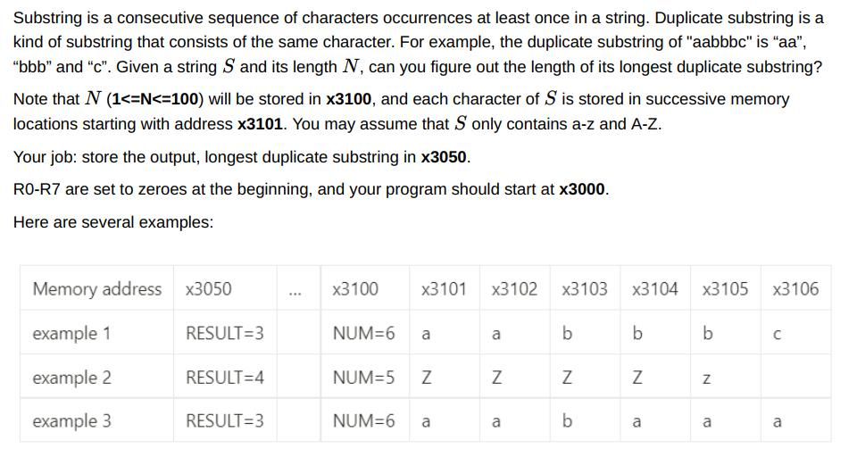

#Lab3 实验报告
### PB21151807 刘海琳
###（一）实验目的
- 本实验将通过使用LC-3 Tools编写汇编码，利用LC-3中的基本指令和寄存器解决以下问题。

  
###（二）实验原理 
 - 寄存器分配
   R0存放字符长度N。R1是指针，指向字符的地址。R2是最长子串长度。R3、R4分别存放前后两个相邻字符的值。R5是当前子串长度。R6用于存放R5的负值。
 - 字符比较
   用R3、R4分别放置前一个字符的值和后一个字符的值，比较的时候计算R4-R3，值为0则说明字符相同，此时R5<-R5+1。如果R4-R3的值不为0，则说明进入了新的子串，此时将R5的值和R2进行比较，更新R2的值。每次指针移动一位，R3、R4指向的字符各向后移动一位。
 - 比较次数
   长度为N的字符一共需要比较N-1次，所以进入循环前R0<-R0-1。
 
###（三）实验过程
 - N=0的时候没有更新R2的值，导致如果最后一个子串是长度最大的，输出结果就不对。所以当字符串检查到最后的时候，先更新一次R2再输出结果到x3050。

###（四）测试结果


###（五）完整代码
```
.ORIG x3000
LDI R0, NUM
LD  R1, DATA    ;R1是指针，指向地址

AND R2, R2, #0
AND R5, R5, #0
ADD R2, R2, #1  ;R2置1
ADD R5, R5, #1  ;R5置1
ADD R0, R0, #-1 ;N-1

LDR R3, R1, #0  ;R3读取R1指向的内容，即第一个字符
ADD R1, R1, #1  ;指针移动
LDR R4, R1, #0  ;R4作为后指针

LOOP NOT R3, R3 ;比较前后字符，R4-R3=0时字符相等
ADD R3, R3, #1
ADD R3, R3, R4
BRnp DIFF
ADD R5, R5, #1
ADD R0, R0, #-1
BRz RE          ;跳转更新R2

NEXT AND R3, R3, #0 ;前后指针移动
ADD R3, R4, #0
ADD R1, R1, #1
LDR R4, R1, #0
BRnzp LOOP

DIFF NOT R6, R5  ;一个子串结束的时候比较R2和R5取最大值放入R2
ADD R6, R6, #1
ADD R6, R2, R6
BRp #4           ;R5>R2时更新R2的值
AND R2, R2, #0
ADD R2, R5, #0
AND R5, R5, #0
ADD R5, R5, #1
ADD R0, R0, #-1
BRnp NEXT
BRz RES

RE NOT R6, R5    ;比较结束的时候再更新一次R2
ADD R6, R6, #1
ADD R6, R2, R6
BRp #2
AND R2, R2, #0
ADD R2, R5, #0

RES STI R2, RESULT
HALT
RESULT .FILL x3050
NUM    .FILL x3100
DATA   .FILL x3101

.END
```