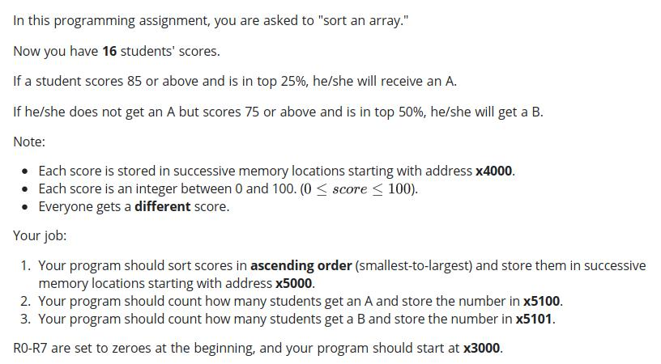
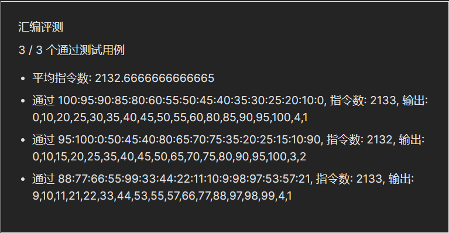

#Lab4 实验报告
### PB21151807 刘海琳
###（一）实验目的
- 本实验将通过使用LC-3 Tools编写汇编码，利用LC-3中的基本指令和寄存器解决以下问题。

  
###（二）实验原理 
 - 分数排序
   - 寄存器分配：R0用于存放正在处理的数字，R1是指针（初始指向x4000），R2用于取成绩单中的其他数字用于与R0比较，R3记录成绩单中比R0当前值要小的数字个数，R4是指针（初始指向x5000），R5存放R6的负值以助R1指向下一个要处理的数字，R6和R7分别用于大循环和小循环的计数（初始值都是16）。
   - 小循环：在一次小循环中，R0的值保持不变，R2一共会取16个值反复与R0的值比较，比较大小的方式是R0先取反加一变为负值再与R2相加，如果结果是负值则说明R0较大，此时R3<-R3+1。循环16次之后R3中的值就是成绩单中数值比R0当前值小的个数，R3+x5000就是R0当前值要存放的地址，借助R4将其放入正确位置。R1指向下一个要处理的数字放入R0，R7复位成16，R6<-R6-1。
   - 大循环：将上述小循环重复进行16次之后，就会在x5000-x500F中得到从小到大排序的成绩单。
 - 拿A的学生人数
   - 寄存器分配：R0用于存放正在判断是否为A的数字，R1是指针（初始指向x500F），R5用于计数A的个数，R6放85用于比较，R7用于循环的计数（初始值为4）。
   - 思路：从最大的数字开始比较，只比较top25%，比较方式是R0取反加一后与R6相加，如果是负值说明R0当前值大于85，该学生得了A，R5<-R5+1。循环4次后将R5的值直接存入x5100即可。
 - 拿B的学生人数
   - 寄存器分配：R0用于存放正在判断是否为B的数字，R1是指针（初始指向x500F），R4用于计数B的个数，R6放75用于比较，R7用于循环的计数（初始值为8）。
   - 思路：从最大的数字开始比较，只比较top50%，比较方式是R0取反加一后与R6相加，如果是负值说明R0当前值大于75，该学生得了B，R4<-R4+1。循环8次后，计算R4-R5存入R4，得到B的人数，存入x5101。
   
 
###（三）实验过程
 - 本实验多次用到循环结构，在循环过程中，有的寄存器的值需要更新，而有的寄存器的值需要重复初始化。初始代码中指针R1的值没有正确的移动，在第一次循环之后就跑出了x400F。故在每次循环开始的时候利用"LD R1, DATA"将R1复位即可。
 - 注意ADD指令可使用的立即数范围不能大于15（因为只有五位），"ADD R0, R0, #16"会在编译的时候直接报错。

###（四）测试结果


###（五）完整代码
```
.ORIG x3000
LD R1, DATA; 16384
AND R7, R7, #0
ADD R7, R7, #15
ADD R7, R7, #1
AND R6, R6, #0
ADD R6, R6, #15
ADD R6, R6, #1
AND R3, R3, #0
AND R4, R4, #0
LDR R0, R1, #0

AGAIN NOT R0, R0
ADD R0, R0, #1
LD R1, DATA
;ADD R1, R1, #1
LESS LDR R2, R1, #0
ADD R2, R2, R0
BRzp #1
ADD R3, R3, #1
ADD R1, R1, #1
ADD R7, R7, #-1
BRnp  LESS
LD R4, START
ADD R4, R3, R4
AND R3, R3, #0
ADD R0, R0, #-1
NOT R0, R0
STR R0, R4, #0
LD R1, DATA
NOT R5, R6
ADD R5, R5, #1
ADD R1, R1, R5
ADD R1, R1, #15
ADD R1, R1, #2;借助R5让R1指向下一个要处理的数
LDR R0, R1, #0
AND R7, R7, #0
ADD R7, R7, #15
ADD R7, R7, #1
ADD R6, R6, #-1
BRnp AGAIN

LD R1, MAX; 20495
AND R7, R7, #0
ADD R7, R7, #4
AND R5, R5, #0
AND R6, R6, #0
ADD R6, R6, #15
ADD R6, R6, #15
ADD R6, R6, #15
ADD R6, R6, #15
ADD R6, R6, #15
ADD R6, R6, #10
TESTA LDR R0, R1, #0
NOT R0, R0
ADD R0, R0, #1
ADD R0, R6, R0
BRp #1
ADD R5, R5, #1
ADD R1, R1, #-1
ADD R7, R7, #-1
BRnp TESTA
STI R5, RESULTA

LD R1, MAX
AND R7, R7, #0
ADD R7, R7, #8
AND R4, R4, #0
AND R6, R6, #0
ADD R6, R6, #15
ADD R6, R6, #15
ADD R6, R6, #15
ADD R6, R6, #15
ADD R6, R6, #15
TESTB LDR R0, R1, #0
NOT R0, R0
ADD R0, R0, #1
ADD R0, R6, R0
BRp #1
ADD R4, R4, #1
ADD R1, R1, #-1
ADD R7, R7, #-1
BRnp TESTB
NOT R5, R5
ADD R5, R5, #1
ADD R4, R4, R5
STI R4, RESULTB

HALT
RESULTA .FILL x5100
RESULTB .FILL X5101
MAX .FILL x500F
START .FILL x5000
DATA .FILL x4000
.END
```