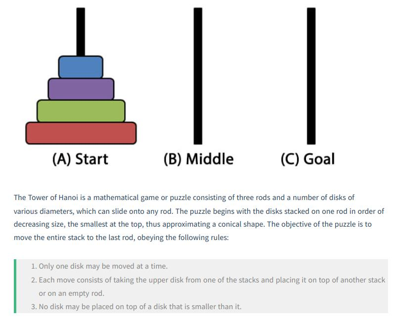
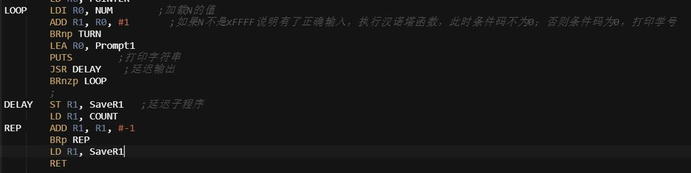
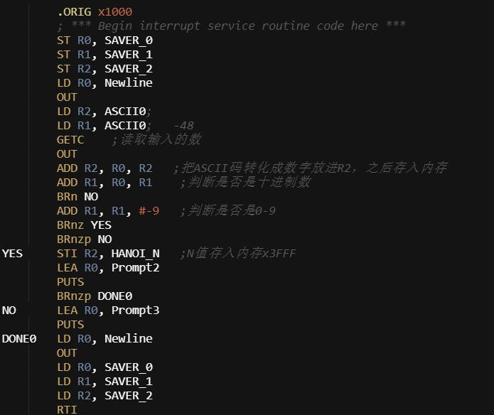
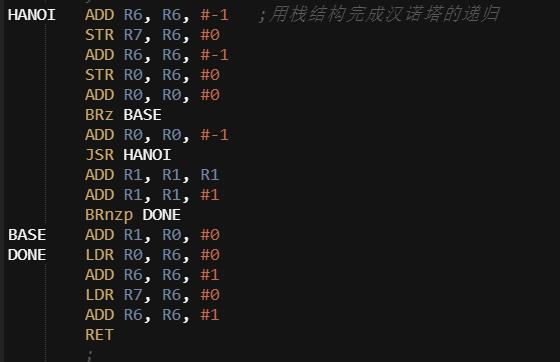
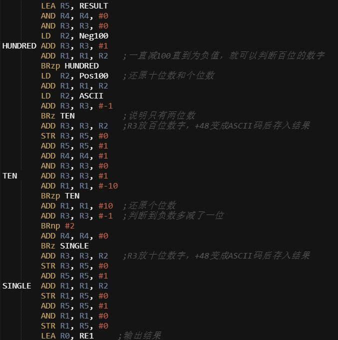
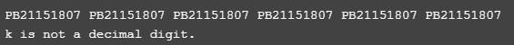
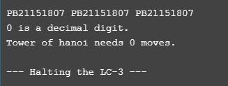
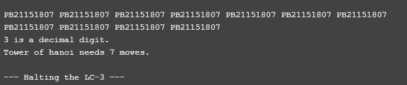
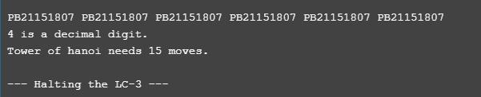
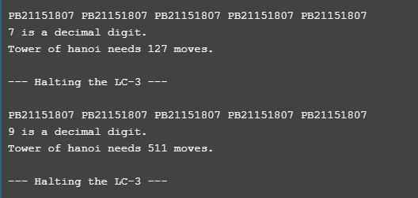

#Lab5 实验报告
### PB21151807 刘海琳
###（一）实验目的
- 本实验将通过使用LC-3 Tools编写汇编码，利用LC-3中的基本指令和寄存器解决以下问题：编写一程序，当键盘没有输入的时候就以合适的速度打印学号。当键盘有输入的时候就判断输入是否是一个十进制数字，并给出相应输出。如果是十进制数字的话就以这个数字为汉诺塔问题的N值，并输出汉诺塔问题的结果。汉诺塔问题描述如下：

  
###（二）实验原理 
 - 延迟程序
   
 - 判断是否为十进制数字：键盘输入后得到的数其实是ASCII码，减去48后如果是0-9，则说明输入的是十进制数字。直接将减去48后的数字是正数，再减9变成负数，就说明输入的数字是0-9，记得存入x3FFF作为汉诺塔的输入。
   
 - 递归的汉诺塔：根据汉诺塔的递归公式H(N)=2H(N-1)+1就可以写出汉诺塔的递归程序。R7是return linkage。
   
 - 二进制转换成ASCII码：首先先判断百位上的数字，将R1反复减100直至为负值，计数的寄存器再加一，这就是百位的数字。百位数字直接加48转化成数字对应的ASCII码。得到的负值再加回100，就得到了原数字去掉百位后剩下的两位数。再判断十位上的数字，以此类推。
   
 
###（三）实验过程
 - 汉诺塔部分的程序，在递归时要注意特殊情况输入为0的处理。其次是有时候循环会比递归更简单，这是以后写程序要注意的地方。

###（四）测试结果
 - 测试结果首先应该涵盖十进制数字0-9以及非十进制数字，其次十进制数字中要包含几个不同的值，比如说N=0的时候汉诺塔输出为0，N=4的时候汉诺塔输出为15，N=7的时候汉诺塔输出为127，这样才能保证二进制转化成ASCII码部分的代码全部正常运行。测试结果如下：






###（五）完整代码
```
#include<stdio.h>
#include<stdlib.h>
#include<math.h>

#define epsilon 0.00000001//停止条件

int Newton(double x){
    double x0=x,x1,a;//a是根的精确值
    int i,n;
    if(x==0.1||x==0.2){ a=0;n=3;}
    else if(x==0.9){ n=2;a=-sqrt(3);}
    else if(x==9.0){ n=2;a=sqrt(3);}
    for(i=1;i<=100000;i++){
        x1=x0-(x0*x0*x0/3-x0)/(x0*x0-1);
        //每步迭代结果
        printf("|e(%d)|/|e(%d)|^%d=%.15E\n",i,i-1,n,fabs(x1-a)/pow(fabs(x0-a),n));
        if(fabs(x1-x0)<epsilon){
            printf("初值=%.1lf,根=%.15E,迭代步数=%d\n",x,x1,i);
            return 0;
        }
        x0=x1;
    }//f在给定初值附近没有根的时候会超出循环
}

int String(double x1,double x2){
    double f1,f2,x,a,n;//a是根的精确值
    f1=x1*x1*x1/3-x1;
    int i;
    if(x1==-0.1||x1==-0.2){ a=0;n=2;}
    else{ a=sqrt(3);n=(1+sqrt(5))/2;}
    //第一步迭代结果
    printf("|e(%d)|/|e(%d)|^%.3lf=%.15E\n",1,0,n,fabs(x2-a)/pow(fabs(x1-a),n));
    for(i=2;i<=100000;i++){
        f2=x2*x2*x2/3-x2;
        x=x2-f2*(x2-x1)/(f2-f1);
        //每步迭代结果
        printf("|e(%d)|/|e(%d)|^%.3lf=%.15E\n",i,i-1,n,fabs(x-a)/pow(fabs(x2-a),n));
        if(fabs(x-x2)<epsilon || fabs(x*x*x/3-x)<epsilon ){
            printf("初值x1=%.1lf,x2=%.1lf,根=%.15E,迭代次数=%d\n",x1,x2,x,i);
            return 0;
        }
        f1=f2;
        x1=x2;
        x2=x;
    }//f在给定初值附近没有根的时候会超出循环
}

int main(){
    int i;
    double x1[4]={0.1,0.2,0.9,9.0};//Newton迭代法初值
    double x2[4][2]={{-0.1,0.1},{-0.2,0.2},{-2.0,0.9},{0.9,9.0}};//弦截法初值
    printf("Newton迭代法:\n");
    for(i=0;i<4;i++){
        printf("第%d组:  ",i+1);
        Newton(x1[i]);
    }
    printf("\n");
    printf("弦截法:\n");
    for(i=0;i<4;i++){
        printf("第%d组:  ",i+1);
        String(x2[i][0],x2[i][1]);
    }
    return 0;
}
```